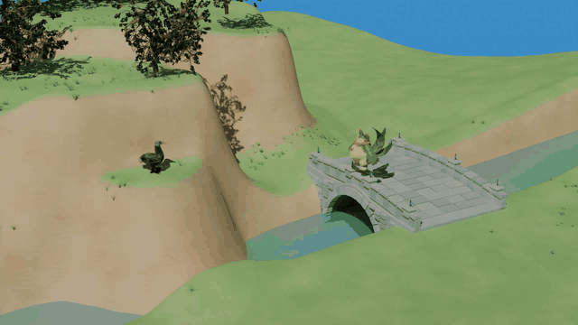

# Agent as 3D Generator

This repository is an agent-oriented procedural modeling workspace built around Infinigen. Its purpose is to give coding agents direct access to real Infinigen source code, Blender/Python modeling patterns, compatibility notes, and reference reconstruction workflows so they can inspect, modify, and author procedural 3D assets with enough local context.

It is not primarily a command launcher for Infinigen. Humans can still run Infinigen commands for validation, but the main value of this repository is the code, documentation, and examples that let an agent reason about `AssetFactory`, `bpy`, Geometry Nodes, materials, scatters, modifiers, instances, and Blender compatibility work.

## Demo

[](./assets/demo.mp4)

Click the preview to open the MP4 version.


## What This Repository Provides

- A full Infinigen source tree for procedural asset and scene-generation context.
- Local compatibility fixes and notes for newer Blender/Python environments.
- Documentation that records which assets, scatters, and scene paths have been checked.
- A reference reconstruction example showing how one image can be turned into a Blender scene through multi-turn agent iteration.
- Codex skill sources that encode repeatable agent workflows for Infinigen asset authoring and Blender-based reconstruction.

## Repository Layout

| Path | Purpose                                                                                                                                          |
| --- |--------------------------------------------------------------------------------------------------------------------------------------------------|
| `reference_reconstruction/` | Two examples through multi-turn dialogue with Codex. <br/> Video demo: [Example1](https://www.bilibili.com/video/BV1Jg96BjEtZ), [Example2](./assets/demo.mp4) |
| `infinigen/` | Main Infinigen source tree used as the procedural modeling codebase.                                                                             |
| `infinigen/docs/WindowsBpy5CompatibilityStatus.md` | Local status record for Blender 5 / Python 3.13 / NumPy 2 compatibility work.                                                                    |
| `infinigen/docs/ReferenceReconstructionAssets.md` | Catalog of reusable local reconstruction assets and their provenance.                                                                            |
| `skill_sources/` | Agent workflow definitions for Infinigen asset authoring and reference reconstruction.                                                           |

## Working Approach

This repository is meant to grow through use. Instead of treating the current documentation as a fixed manual, agents should use the codebase, Blender scene state, generated artifacts, validation logs, and human feedback as live context. When a modeling problem reveals a new pattern, compatibility issue, asset behavior, or useful verification method, that knowledge should be folded back into the repository.

The expected loop is:

1. Explore the existing Infinigen implementation and nearby examples.
2. Use Blender, temporary generated artifacts, screenshots, or smoke tests to understand the actual 3D result.
3. Modify assets, materials, scatters, node helpers, skills, or documentation as the task requires.
4. Preserve procedural structure where it helps future editing: modifiers, Geometry Nodes, instances, particles, and provenance.
5. Update the shared knowledge in this repository so future agents start from a better place.

The skills in `skill_sources/` capture some of this process, but they are not the end of it. They should evolve as repeated work exposes better modeling routes, clearer validation habits, and more reliable agent conventions.

## Environment Setup

This workspace should be used as a live source checkout. The agent is expected to read and modify the code under `infinigen/`, so the runtime should import this checkout directly instead of relying on an installed copy of the package.

Use these documents as inputs when preparing an environment:

- `infinigen/docs/Installation.md`
- `infinigen/docs/WindowsBpy5CompatibilityStatus.md`

The official Infinigen installation guide explains the upstream dependency model and platform support. The compatibility record describes the Windows environment used for local testing and the issues found there. The code in this repository has already been modified for newer `bpy` 5 compatibility, so provide both documents to the agent and let it choose the dependency strategy for the task: minimal asset authoring, interactive Blender work, terrain, simulation, or compatibility debugging.

A typical starting point is:

```bash
cd infinigen
conda create --name agent-3d-generator python=3.13
conda activate agent-3d-generator
```

Then install the dependencies selected for the target environment. The local `requirements.txt` can be used as one dependency snapshot, but the agent should compare it with `pyproject.toml`, the official installation guide, and the compatibility record before deciding what to install.

Do not install the Infinigen package itself for normal agent work. Instead, make sure the runtime imports the live source tree. In practice, this has usually meant either running Python from the `infinigen/` directory, or inserting the repository path into `sys.path` inside the active Blender process.

For interactive Blender work and Blender MCP sessions, make sure the active Blender process can import both this `infinigen/` source tree and its Python dependencies. The open Blender process may not share the same `sys.path` as the shell Python environment, so the agent may need to add paths directly in Blender:

```python
import sys

repo_root = r"<path-to-this-repository>/infinigen"
if repo_root not in sys.path:
    sys.path.insert(0, repo_root)
```

Setting `PYTHONPATH` before launching a process is an equivalent option, but it is not required if the agent controls `sys.path` directly.

## Optional Human Validation

The repository is agent-first, but humans can still run targeted checks from `infinigen/` when needed. For example, a single asset can be generated with:

```powershell
python -m infinigen_examples.generate_individual_assets --output_folder <output-folder> -f CoralFactory -n 1 --save_blend --render none
```

Use these commands as validation tools, not as the main project interface.

## Acknowledgements

We thank the [Infinigen](https://infinigen.org/) authors and contributors for creating an unusually rich procedural 3D codebase, which makes this kind of agent-driven modeling exploration possible.
